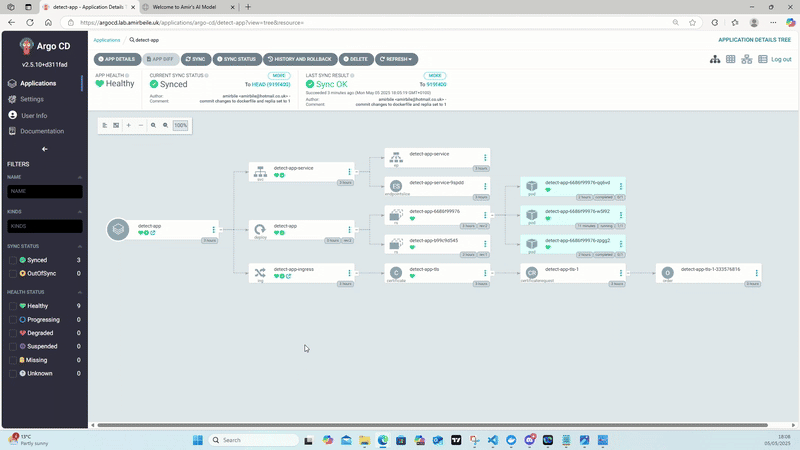

**Production Ready Automated EKS Cluster Deployment with Helm and GitOps**
==========================================================================

Overview
--------

This project automates the deployment of an AWS EKS Kubernetes cluster using Terraform and Helm, integrating essential tools such as NGINX Ingress Controller, Cert-Manager for automatic SSL management via Let’s Encrypt, External DNS syncing with Route53, and optional ArgoCD for GitOps-based continuous deployment and Prometheus & Grafana for monitoring and observability. The cluster supports secure, public-facing apps via HTTPS with automated DNS and certificate management. AWS Fargate is mentioned but not used in this setup. Terraform manages infrastructure, IAM roles, and Helm chart deployments, enabling a DRY, scalable, and production-grade Kubernetes environment.

--------

--------

Objective
---------

Host applications in Kubernetes and expose them publicly and securely via ingress controllers combined with signed SSL certificates for HTTPS.

This project deploys an EKS cluster with automated certificate management, DNS integration, and a fully functional ingress controller. ArgoCD integration allows for GitOps-based deployments.

_Optional AWS Fargate is used to run workloads without managing EC2 instances, reducing operational complexity._

Tools Utilised
--------------

*   **Helm (Kubernetes package manager)** - To deploy and manage the application.
    
*   **NGINX Ingress Controller** - Manages ingress and automates SSL certificate issuance.
    
*   **Let's Encrypt (Certificate Authority)** - Automates SSL certificate issuance and renewal.
    
*   **Cert-Manager** - Automates certificate management.
    
*   **External DNS** - Syncs Kubernetes services with your DNS provider (Route53).
    
*   **ArgoCD (Optional)** - For GitOps continuous deployment.
    
*   **AWS Fargate** - Serverless compute engine for running Kubernetes pods without managing EC2 instances. _We won't be using this but it helps to know._
    
*   **Prometheus and Grafana:** Monitoring and Observability (in progress)
    

Steps
-----

1.  Write Terraform code to deploy and automate resources (VPCs, EKS Clusters, IAM roles, Service Accounts, etc.) in AWS.
    
2.  Deploy Helm charts (Cert-Manager, Ingress Controller, External DNS, etc.) via Terraform after the cluster is created.
    
3.  Deploy a test application and demonstrate how it:
    
    *   Uses SSL certificates for HTTPS.
        
    *   Communicates via ingress.
        
    *   Integrates with ArgoCD (if used).
        

Dockerfile Build
----------------

1.  `aws ecr get-login-password --region <region> | docker login --username AWS --password-stdin <ID number>.dkr.ecr.<region>.amazonaws.com`
    
2.  `docker build -t detect-app .`
    
3.  `docker tag detect-app:latest <ID number>.dkr.ecr.<region>.amazonaws.com/detect-app:latest`
    
4.  `docker push <ID number>.dkr.ecr.<region>.amazonaws.com/detect-app:latest`
    

Delegate Cloudflare Domain to AWS
---------------------------------

1.  Delegate Cloudflare Domain amirbeile.uk as the subdomain lab.amirbeile.uk to AWS via Route53.
    
2.  Verify host names with `nslookup -type=NS lab.amirbeile.uk`
    

vpc.tf and locals.tf Creation
-----------------------------

*   Use a community VPC module to adhere to DRY principles.
    
*   Use locals.tf for variable and key-value management.
    

Create EKS Cluster
------------------

*   Use community EKS module with allow\_public\_access = true for testing.
    
*   Enable IRSA (IAM Roles for Service Accounts) for Cert-Manager and External DNS.
    
*   VPC configured with public/private subnets; control plane public, nodes private.
    
*   Create managed worker nodes; optionally configure AWS Fargate (not used here).
    

**Permissions for Cert-Manager & External DNS**

*   Cert-Manager needs Route53 access to create TXT records for domain validation.
    
*   External DNS automates DNS record creation.
    

### AWS Fargate Integration (Optional - Not used here)

Enable AWS Fargate in EKS by defining a `Fargate Profile`. Example resource::

   ```hcl
   resource "aws_eks_fargate_profile" "default" {
     cluster_name           = aws_eks_cluster.this.name
     fargate_profile_name   = "default"
     pod_execution_role_arn = aws_iam_role.fargate.arn
     subnet_ids             = module.vpc.private_subnets
     selector {
       namespace = "default"
     }
   }
   ```

Verify Fargate pods:

`kubectl get pods -n default`

Cert-Manager and External DNS Permissions
-----------------------------------------

*   Cert-Manager manages SSL certs.
    
*   External DNS manages DNS records in Route53.
    
*   Both require IAM permissions for Route53 hosted zones.
    

IAM Roles for Service Accounts (IRSA) - Cert-Manager
----------------------------------------------------

*   Use community IRSA module.
    
*   Attach Cert-Manager policy.
    
*   Example:
    

`cert_manager_hosted_zone_arns = ["arn:aws:route53:::hostedzone/Z123456ABC"]`

**OIDC Explanation:**

*   OIDC (OpenID Connect) links Kubernetes service accounts to AWS IAM roles.
    
*   IRSA (IAM Roles for Service Accounts) allows Kubernetes pods to access AWS securely.
    
*   Terraform configures OIDC providers for authentication.
    

External DNS IRSA
-----------------

*   Use IRSA module.
    
*   Attach External DNS policy.
    
*   Example:
    

`external_dns_hosted_zone_arns = ["arn:aws:route53:::hostedzone/Z123456ABC"]`

Add Provider and S3 Backend
---------------------------

Terraform backend:

```
   terraform {
     backend "s3" {
       bucket = "eks-tfstate-amir"
       key    = "terraform.tfstate"
       region = "eu-west-2"
     }
   }
```

```
   provider "aws" {
     region = "eu-west-2"
   }

   provider "helm" {}
```

Set AWS Access Keys
-------------------

```
export AWS_ACCESS_KEY_ID="*****"
export AWS_SECRET_ACCESS_KEY="*****"
export AWS_DEFAULT_REGION="eu-west-2
```

Verify/ check authentication:

```
aws sts get-caller-identity
```

If S3 bucket missing create one.


Create the S3 Bucket via Console
--------------------------------

*   Create bucket eks-tfstate-amir in AWS S3 console.
    

Terraform Resources Created
---------------------------

*   aws\_kms\_key - encryption keys
    
*   aws\_iam\_policy\_document.this - IAM permissions
    
*   aws\_eks\_cluster - EKS cluster
    
*   aws\_eks\_fargate\_profile - Fargate config
    
*   aws\_vpc - VPC
    
*   aws\_subnet - Subnets
    
*   aws\_route\_table - Routing
    

EKS Access Configuration, Review + kubectl
==========================================

Update kubeconfig:

`aws eks --region eu-west-2 update-kubeconfig --name eks-lab`

To allow kubectl access, configure EKS IAM access entry:

### Via Terraform (Preffered)

*   Create aws\_eks\_access\_entry with:
    
    *   `AmazonEKSAdminPolicy`
        
    *   `AmazonEKSClusterAdminPolicy`


### Via AWS Console

1.  Create Access Entry with:
    
    *   IAM Principal ARN
        
    *   Username: eks-admin
        
    *   Group: admin
        
    *   Attach `AmazonEKSAdminPolicy` and `AmazonEKSClusterPolicy`
        

Deploying the Resources
=======================

Use Terraform to deploy Helm releases:

*   Cert-Manager
    
*   NGINX Ingress Controller
    
*   External DNS
    

### NGINX and Cert-Manager Helm Releases

*   Helm deploys resources with namespace auto-creation.
    
*   Cert-Manager uses custom values in `helm-values/cert-manager.yaml`.
    
*   Set flags such as installCRDs = true to create CRDs.
    

### External DNS Deployment

*   Create Helm values in `helm-values/external-dns.yaml`.
    
*   Deploy in its own namespace external-dns.
    
*   Ensure IRSA roles and Helm charts namespaces align.
    

Linking Helm Releases and Cluster Provider
------------------------------------------

*   Use the Helm provider with proper kubeconfig and AWS IAM role setup.
    
*   The ingress controller provisions an AWS Network Load Balancer (NLB), Layer 4 so it travels straight through.
    
*   Check NGINX ingress load balancer with:
    

`kubectl get svc -n nginx-ingress`

### Check Logs

`kubectl -n external-dns logs <external-dns>`
`kubectl -n cert-manager logs <cert-manager>`

Deploying ArgoCD
----------------

*   Create a **ClusterIssuer** with cert-man/issuer.yaml:
    

`kubectl apply -f cert-man/issuer.yaml`

*   Verify issuer:
    

`kubectl get clusterissuers.cert-manager.io`

*   Deploy ArgoCD Helm release in helm.tf.
    
*   External DNS manages DNS for ArgoCD; Cert-Manager manages SSL certificates.

`kubectl apply -f config-argo-app/app-argocd.yaml`
    

### Logging into ArgoCD

`kubectl get secret --namespace <your_namespace> <your_release_name> -o jsonpath='{.data.admin-password}' | base64 --decode`

*   Username: admin
*   Password: `kubectl get secret argocd-initial-admin-secret -n argo-cd -o jsonpath='{.data.password}' | base64 --decode`


Breakdown of the above code

1)   Retrieve secret in base64

```
kubectl get secret argocd-initial-admin-secret -n argo-cd -o 
```


2)   decode base64

```
- echo "*****" | base64 -d`
```


Prometheus and Grafana
======================

Prometheus and Grafana are deployed using Helm with values configured in `helm-values/`.

### Grafana Certificate Fix

*   A new certificate was added to `grafana.yaml` via the secretName field.
    
*   The Grafana domain was added to the DNS zones in issuer.yaml.
    

### Access Grafana - Log in

`kubectl get secret --namespace prometheus prometheus-grafana -o jsonpath="{.data.admin-password}" | base64 --decode`


Persistent Storage
------------------

Persistent volumes have been configured to resolve ephemeral storage issues observed in Grafana.

Terraform Destroy Steps
=======================

Step 1: Destroy Helm Releases
-----------------------------

```
terraform destroy -target=module.helm.helm_release.nginx_ingress -auto-approve
terraform destroy -target=module.helm.helm_release.cert_manager -auto-approve
terraform destroy -target=module.helm.helm_release.external_dns -auto-approve
terraform destroy -target=module.helm.helm_release.argocd_deploy -auto-approve
terraform destroy -target=module.helm.helm_release.prometheus -auto-approve
terraform destroy -target=module.helm.kubernetes_manifest.detect_app_servicemonitor -auto-approve
terraform destroy -target=module.helm.kubernetes_manifest.prometheus_alert_rules -auto-approve
terraform destroy -target=module.helm.kubernetes_manifest.site_traffic_dashboard -auto-approve
```

Step 2: Destroy IRSA Roles
--------------------------

```
terraform destroy -auto-approve \
  -target="module.infrastructure.module.cert_manager_irsa_role.aws_iam_policy.cert_manager[0]" \
  -target="module.infrastructure.module.cert_manager_irsa_role.aws_iam_role.this[0]" \
  -target="module.infrastructure.module.cert_manager_irsa_role.aws_iam_role_policy_attachment.cert_manager[0]" \
  -target="module.infrastructure.module.external_dns_irsa_role.aws_iam_policy.external_dns[0]" \
  -target="module.infrastructure.module.external_dns_irsa_role.aws_iam_role.this[0]" \
  -target="module.infrastructure.module.external_dns_irsa_role.aws_iam_role_policy_attachment.external_dns[0]"
  ```

